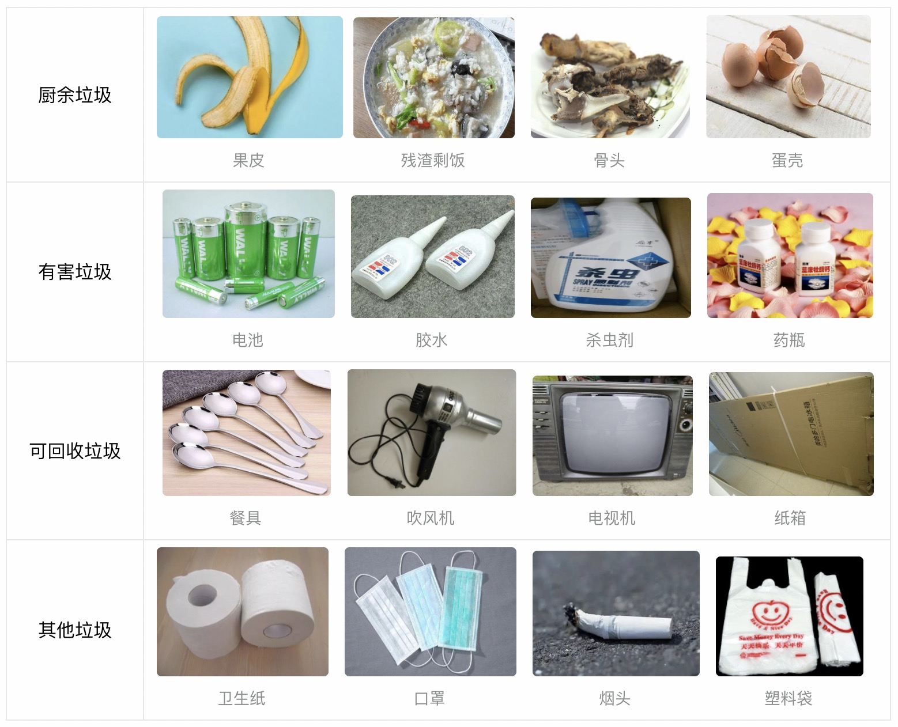

# Garbage265 垃圾分类系统 (基于 YOLOv5 层级架构)

本项目是一个基于 YOLOv5 图像分类架构的高精度生活垃圾分类系统。它不仅仅是一个 265 细类别的分类器，更在核心层面上实现了**层级多头输出**（Hierarchical Classification），能同时预测垃圾的**具体小类**（如：可乐瓶）和**四大归属大类**（可回收物、厨余垃圾、有害垃圾、其他垃圾），并自动提供 Mac M 系列芯片下的 CoreML 本地加速推理能力。



## 📌 项目核心亮点

- **层级架构 (Hierarchical Classification)**: 官方 YOLOv5 分类模型只支持一层输出。本项目对其源码进行了定制深度魔改（`patches/`），使得模型在拥有 `loss_sub` (265类) 的同时，引入了 `loss_major` (4大类)，由权重 `major_weight` 动态平衡，大幅提升类别归属准确率。
- **自动环境武装**: 提供鲁棒的自动化装配脚本 `setup.sh`，可自动下载 13GB 原数据集，自动规避 OOM。
- **M2/M3 CoreML 加速**: 内置针对 macOS Neural Engine 的本地摄像头防抖推理代码 (`camera_predict.py`)。

---

## 🛠️ 快速开始

### 1. 克隆代码 & 初始化环境

本项目不直接包含巨大的官方 YOLOv5 源码，而是采用**动态魔改**策略规避代码冗余：

```bash
git clone <YOUR_REPO_URL>
cd garbage265

# 一键初始化：会自动配置 Python 环境，克隆最新 YOLOv5، 并应用我们的魔改补丁
bash setup.sh
```

> **注意：** `setup.sh` 会自动调用 `apply_patches.sh`，将 `patches/` 目录下的核心架构补丁覆盖到刚下载好的 `yolov5/` 中。

### 2. 核心补丁说明 (`patches/`)
如果你想手动理解系统原理，请查看 `patches/` 目录：
- `models/yolo.py` & `common.py`: 增加了针对大类、小类双重输出的定制网络层 `Classify()`。
- `classify/train.py`: 重写了 Loss 的计算公式（`loss = loss_sub + 0.5 * loss_major`）。
- `utils/hierarchical.py`: 提供 `[0-264]` 索引向 `四大类` 映射的张量计算逻辑。

---

## 🚀 训练与推理

### 方案一：本地训练

确保你在一台拥有英伟达 GPU（至少 24GB 显存，推荐 3090/4090）的机器上运行。

```bash
# 启动训练
python train_classify.py \
    --model yolov5x-cls.pt \
    --epochs 80 \
    --batch 128 \
    --img 448
```
*所有超参、数据路径验证已在 `train_classify.py` 内部固化调优，直接运行即可。*

### 方案二：一键云端部署 (推荐)

如果你使用远程 GPU 服务器（如 AutoDL、算力云或实验室服务器），可以使用本项目提供的自动化部署脚手架 `remote_deploy.sh`，避开繁琐的手动 FTP/SCP 同步：

1. 编辑 `remote_deploy.sh`，将顶部配置项修改为你的服务器信息：
   ```bash
   HOST="YOUR_SERVER_IP"
   PORT="22"
   USER="root"
   ```
2. 在本地执行部署：
   ```bash
   bash remote_deploy.sh
   ```
> 该脚本会自动将核心代码推送到服务器，跳过环境装配（`setup.sh`），并用 `nohup` 挂起后台训练任务，关机也不会中断！

### 图片推理

```bash
# 单张图片预测
python predict.py --img test.jpg

# 实时摄像头预测 (Mac 专用，带滑动窗口平滑与 CoreML 加速)
python camera_predict.py
```

---

## 📁 项目结构说明

```
.
├── setup.sh                 # 环境、数据集下载、自动应用补丁的入口
├── apply_patches.sh         # 补丁覆盖脚本
├── patches/                 # [核心] 深度魔改的 YOLOv5 源码文件
├── train_classify.py        # 训练启动脚本（包装了 YOLOv5 内部命令）
├── predict.py               # 单图推理脚本
├── camera_predict.py        # 摄像头实时检测脚本
├── remote_deploy.sh         # 一键推送到云 GPU 的部署脚本
├── diagnose_*.py            # 数据集诊断与标签对齐映射检查工具
├── requirements.txt         # 依赖配置
├── classname.txt            # 265 种垃圾对应的中文标签
├── garbage265_hierarchical/ # 训练日志与最佳权重存放地 (Best.pt 等)
└── README.md                # 本文档
```

---

## 📦 原始数据集描述

本项目所引用的数据集为 147674 张带中文标签的生活垃圾图像集，包含可回收垃圾、厨余垃圾、有害垃圾、其他垃圾4个标准垃圾大类，覆盖常见的食品，厨房用品，家具，家电等265个垃圾小类。数据大小为13GB。

### 数据集元数据
```yaml
image:
  image-classification:
    size_scale:
      - 10k-1m
tags:
  - 垃圾分类
  - classification
  - garbage
```

### 数据加载方式 (独立于项目框架)
此代码可方便提取原始数据到别处。
```python
from modelscope.msdatasets import MsDataset
from modelscope.utils.constant import DownloadMode

# 加载训练集
ms_train_dataset = MsDataset.load(
            'garbage265', namespace='tany0699',
            subset_name='default', split='train',
            download_mode=DownloadMode.REUSE_DATASET_IF_EXISTS)
print(next(iter(ms_train_dataset)))
```

---

## 📄 许可证

本项目遵循仓库内 `LICENSE` 约束。